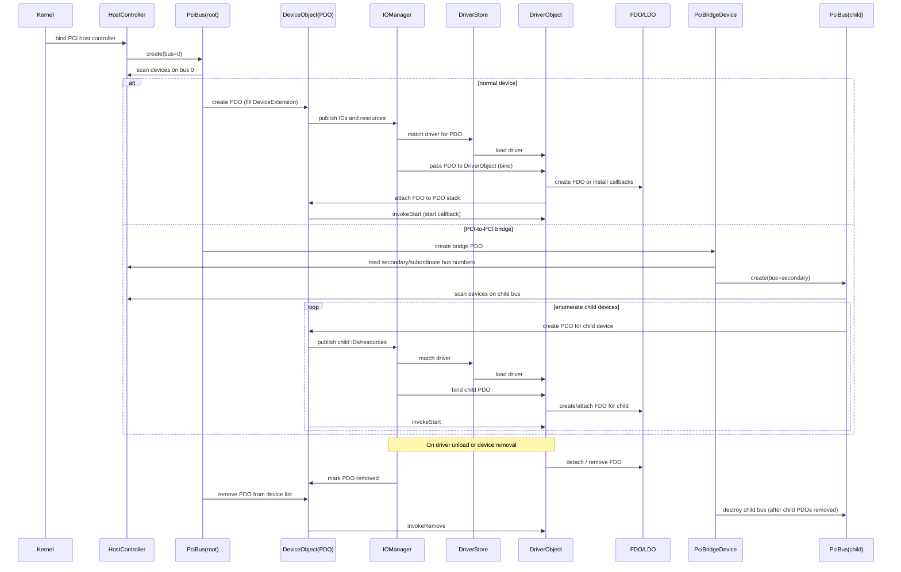

# UnDOS Operating System Core

Welcome to the **UnDOS** core architecture tree. UnDOS utilizes a decoupled design featuring a standalone **Kernel Core** and an architectural **Hardware Abstraction
Layer (HAL)**.

Rather than compiling the system into a monolithic binary or relying on complex runtime User-Mode/Kernel-Mode IPC for basic hardware initialization, UnDOS utilizes a
custom **Stage 1.5 Trampoline Engine** that dynamically cross-links static executables and sets up the high-half paging structures at boot time.

UnDOS is a lightweight, modular operating system targeting Intel 386, 486, and Pentium processors. It is written primarily in modern C++, with a focus on simplicity,
efficiency, and a familiar graphical environment.

## Goals

- **Retro Modernity:** Provide a modern modular OS architecture for retro x86 hardware.
- **Developer Experience:** Offer a clean and simple developer experience using modern C++.
- **Legacy Preservation:** Support classic DOS‑era software through compatibility layers.
- **Classic UI:** Deliver a lightweight GUI inspired by early Windows environments.

## Kernel Architecture & Boot Pipeline

UnDOS uses a design philosophy closer to Windows NT than DOS or Windows 9x. Subsystems and drivers are cleanly separated to encourage modularity. Everything is treated as
an object, and the system relies on a namespaced standalone C++ standard library (`kstd`, derived and stripped from LLVM `libc++`).

The boot execution sequence shifts through four distinct environments before launching the kernel shell:

```text
[ GRUB / Multiboot 2.0 ]
        │
        ▼ (Loads Stage 1.5 ELF + Modules)
[ Stage 1.5 Trampoline ] ── (Parses headers, populates boot_info_t)
        │
        ▼ 
[ Kernel Core ] 
        |
        ▼ 
[ Hardware Abstraction Layer (HAL) ] ── (Initializes GDT/IDT/PIC/PIT/VMM)

```

### Stage Responsibilities

1. **Multiboot (GRUB):** Selects the target image, reads `grub.cfg`, configures raw 32-bit protected mode, and exposes the system topology map.
2. **Stage 1.5 (Trampoline):** Executes identity-mapped at physical `0x00100000` (1MB). It parses the raw Multiboot modules, maps sections to target physical frames,
   cross-stitches undefined references across binary barriers, sets up high-half tables, and enables the CPU MMU paging bit.
3. **HAL (`hal_x86_old`):** Executes in high-half space immediately following the Kernel Core. Handles ISA bus configurations, static non-PnP devices via `CONFIG.REG`, legacy PIC/APIC
   wiring, and basic interrupt context delivery.
4. **Kernel Core (`kernel`):** Executes in high-half space starting at `0xC0000000`. Architecture-agnostic payload containing the VFS, scheduler, Object Manager, NT-style
   personality subsystems, and high-level process execution engines.

## Memory Mapping Matrix

The Stage 1.5 loader maps the hardware memory architecture according to this physical-to-virtual layout layout contract:

| Subsystem Component            | Virtual Base Address (VMA)             | Target Physical Frame                 | Mapping Scheme / Flags                    |
|--------------------------------|----------------------------------------|---------------------------------------|-------------------------------------------|
| **Low-Memory Identity Line**   | `0x00000000` - `0x003FFFFF`            | `0x00000000`                          | Temporary Execution Coverage (`0x003`)    |
| **Stage 1.5 Runtime Base**     | `0x00100000`                           | `0x00100000`                          | Identity-mapped via GRUB                  |
| **Kernel Core Space**          | `0xC0000000`                           | `0x01000000` (16MB)                   | Supervisor, Present, Read/Write (`0x003`) |
| **Hardware Abstraction Layer** | `0xC0000000` + Kernel Size             | `0x01000000` + Kernel Size            | Supervisor, Present, Read/Write (`0x003`) |
| **Recursive Directory**        | `0xFFC00000`                           | Page Dir Physical                     | Map slot 1023 straight into itself        |

## Executable & Compatibility Model

UnDOS treats **ELF** as its native executable format. While it uses absolute binaries for the Kernel and HAL, the Stage 1.5 loader implements **In-Place GOT Patching**
and runtime relocation handling. This allows these modules to be dynamically placed in memory while supporting cross-binary function calls through standard ELF mechanisms:

* **`--emit-relocs`**: Retains internal relocation records (`.rel.text`, `.rel.data`) inside the output ELF executables.
* **`--unresolved-symbols=ignore-all`**: Permits the cross-compiler to generate an executable even if functions belonging to the matching binary are missing, designating
  them as `SHN_UNDEF` hooks for Stage 1.5 to patch at boot.

### Legacy Support

* **Native ELF:** Standard 32‑bit ELF binaries run directly on the kernel.
* **DPMI DOS Executables:** For common DOS extenders, UnDOS extracts the embedded 32‑bit binary and executes it inside an environment compatibility layer. This allows
  many legacy DOS applications to run natively without spinning up a full x86 real-mode emulation instance.

## The Handover Contract (`boot_info_t`)

Subsystems exchange environment layouts via a unified data ledger, evaluated dynamically by Stage 1.5 and pushed down the pipeline:

```c++
enum class MemoryRegionType : uint32_t {
  AVAILABLE = 1,   // Usable RAM for the PMM / Allocator
  RESERVED = 2,    // Hardware, ACPI tables, or bad memory
  ACPI_RECLAIM = 3,// Safe to reclaim after ACPI initialization
  BOOTLOADER = 4,  // Memory used by the bootloader itself
  KERNEL_STACK = 5 // Kernel stack memory
};

struct memory_region_t {
  uint64_t base;   // 64-bit bounds tracking to natively support PAE/x86_64 scaling
  uint64_t length;
  MemoryRegionType type;
};

struct boot_info_t {
  uint32_t page_size;
  uint32_t hal_more_into_addr;

  memory_region_t *memory_map;
  size_t memory_map_count;

  uintptr_t kernel_physical_start;
  uintptr_t kernel_physical_end;   // Calculated dynamically via PT_LOAD size
  uintptr_t kernel_virtual_start;
  uintptr_t kernel_virtual_end;     // The PMM uses this to safely align the allocation bitmap

  uintptr_t hal_virtual_start;
  uintptr_t hal_virtual_end;

  char *command_line;        // Raw boot flags forwarded from GRUB
};

```

## Graphical User Interface

The GUI is heavily inspired by GDI and the classic Windows 3.1 / Workgroups environment:

* Basic primitive window management and dirty rect z-ordering.
* Lightweight software pixel rendering pipeline optimized for retro VGAM/SVGA contexts.
* Simple, predictable, keyboard/mouse event focus structures.

## File System Notes

* **No Access Control Lists:** No ACL support implemented (and intentionally omitted for simplicity).
* **Minimal Attributes:** Only basic file flags (Read-Only, Hidden, System, Directory) are supported.
* **Permissions:** Permissions model is intentionally minimal for now to mirror vintage single-user desktop experiences.

## Developer

### How to build

1. Clone the repository and navigate to the project directory.
2. In the `[DockerGccCross](DockerGccCross)` directory there's a Dockerfile for making a build container
3. Run `cmake` in a compatible environment to generate the build system.
4. Build `BootIso` target using the generated build system; this builds everything with the x86-old hal
5. Debug with `qemu-system-i386 -machine isapc -cpu 486 -m 32 -S -gdb tcp::1234 -no-reboot -no-shutdown -nodefaults -chardev stdio,id=ser0 -device isa-serial,chardev=ser0 -drive file=os.iso,media=cdrom,readonly=on`

### Adding a New Cross-Binary Function

1. Declare the function interface prototype in a header inside `kernel_headers` using either `UNDOS_KERNEL_API` or `UNDOS_HAL_API`.
2. Implement the function inside its native project target normally.
3. You can reference and call this function instantly from the alternate target module. Stage 1.5 will automatically cross-stitch the references when parsing the
   `.symtab` layouts during boot.

### Code Generation Invariant Rules

> [!IMPORTANT]
> When generating code modifications or additions for the UnDOS codebase, you must adhere strictly to these constraints:

* **No Standard Library Headers:** Do not include `<iostream>`, `<string>`, `<vector>`, or any hosted standard header. You must use header-only equivalents provided by
  `<strfmt.hpp>` or `libkcpp` in the `kstd` namespace.
* **PMM Initialization Placement:** Any allocation arrays, tracking structures, or page frame bitmaps generated for memory subsystem design must calculate their initial
  position pointers starting exactly at `boot_info->kernel_virtual_end`. Do not use hardcoded markers.
* **Maintain C-Linkage on Exports:** Any function annotated with API visibility must use `extern "C"` to prevent C++ name-mangling, as the Stage 1.5 dynamic symbol map
  matches string identifiers exactly.

# Next Todos



* [ ] Implement initial GDT reload structure inside x86 HAL initialization sequence
* [ ] Complete early device tree parsing from `CONFIG.REG` file node arrays

